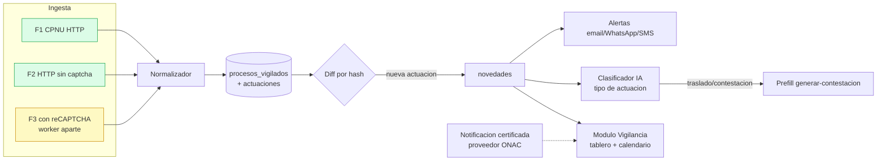

# Vigilante Judicial en FoQs — diseño técnico (borrador)

> Feature de valor agregado: vigilancia judicial automática integrada al núcleo de FoQs
> (generación de fichas/contestaciones). Aprovecha lo aprendido de Lumy pero da el salto que Lumy no
> da: **detectar la actuación → preparar el escrito**. Stack: Next.js 14 App Router + Supabase.
> Fecha: 2026-09-16.

## 1. Objetivo y alcance
Monitorear procesos judiciales de Colpensiones y avisar automáticamente cuando cambian, ligando cada
proceso al **caso/ficha** para que una actuación relevante (p. ej. traslado de demanda) **dispare** el
flujo de contestación que ya existe.

## 2. Qué ya existe (reutilizable)
- **Ingesta CPNU** (`app/api/rama-judicial/route.ts`): proxy a `consultaprocesos.ramajudicial.gov.co`
  → por radicado (23 díg.) obtiene `idProceso` y sus **actuaciones**. Hoy es on-demand
  (`components/fichas/consulta-radicado.tsx`). **Es la Fuente 1** (HTTP, sin captcha).
- **Casos** (`casos`, con `org_id`), **perfiles/organizaciones** (multiusuario/roles),
  **importar-excel** (carga masiva), **generar-contestacion**, envío de **email**.
- Nota de proyecto: 3 fuentes (F1/F2 auto por HTTP sin captcha; **F3 con reCAPTCHA**), flujo columna G.

## 3. Arquitectura



**Clave:** F1/F2 corren en serverless/cron; **F3 (reCAPTCHA) NO cabe en Vercel serverless** → **worker
separado** (VM/servicio propio o Supabase Edge Function con navegador headless + solver), que escribe
en la misma BD. El resto (diff, alertas, UI, enlace al generador) es Next.js + Supabase.

## 4. Modelo de datos (Supabase)
```
procesos_vigilados
  id uuid pk · org_id · caso_id (fk casos, nullable) · radicado(23) · id_proceso_externo
  fuente (f1|f2|f3) · despacho · sujetos jsonb · ciudad · departamento
  activo bool · frecuencia (diaria|12h) · ultima_revision timestamptz
  ultima_actuacion_fecha · ultima_actuacion_hash · creado_por · created_at

actuaciones
  id uuid pk · proceso_id fk · fecha · tipo · anotacion text · fecha_registro
  hash text (dedup/diff) · clasificacion_ia jsonb · leida bool · created_at
  unique(proceso_id, hash)

audiencias
  id uuid pk · proceso_id fk · fecha · tipo · despacho · fuente(auto|manual) · estado

novedades
  id uuid pk · proceso_id fk · actuacion_id fk · resumen · nivel(info|accion) · atendida bool · created_at

alertas_config       (por usuario/proceso: canales email/whatsapp/sms, on/off)
notificaciones_log   (canal, destinatario, estado, evidencia jsonb, proceso_id)
```
RLS por `org_id` (igual que `casos`). Índices por `radicado`, `proceso_id`, `fecha`.

## 5. Ingesta y scheduler
- **F1/F2:** función de vigilancia que, para cada `proceso_vigilado` activo, llama la fuente, trae
  actuaciones, calcula `hash` por actuación e **inserta solo las nuevas** (unique proceso_id+hash).
- **Programación:** `pg_cron` en Supabase (o **Supabase Edge Functions** en cron) → evita el límite de
  60s de Vercel Hobby y no depende del front. Alternativa: Vercel Cron (cuidando el timeout).
- **F3 (reCAPTCHA):** worker externo (Node + Playwright headless + servicio de captcha) que corre en
  su propio cron y hace `upsert` en `actuaciones`. Aislado del serverless.
- **Backoff y cortesía:** límite de concurrencia y reintentos; respetar la carga de la Rama Judicial.

## 6. Detección de novedades (diff)
`hash = sha1(fecha + tipo + anotacion)`. Si aparece un hash no visto para el proceso → nueva
`actuacion` + `novedad`. Se actualiza `ultima_actuacion_hash/fecha` en `procesos_vigilados`.

## 7. Alertas y notificación certificada
- **Aviso (interno):** email (ya existe) + **WhatsApp/SMS** vía proveedor (Twilio/Meta WhatsApp API).
  Config por usuario/proceso.
- **Notificación certificada (a terceros, con validez probatoria):** **NO** construir el sello propio;
  **integrar un proveedor acreditado por ONAC** (como el que usa Lumy: cert. 16-ECD-004) por su API.
  FoQs arma el mensaje/adjuntos y el proveedor devuelve la **evidencia de entrega** → se guarda en
  `notificaciones_log.evidencia`. Modelo de cobro por paquetes (como Lumy) si se monetiza.

## 8. Módulo/UI (Next.js)
- Ruta protegida `/(protected)/vigilancia`: **tablero de novedades**, **calendario de audiencias**,
  lista de **procesos vigilados** (alta manual, por partes/sin radicado completo, o **carga masiva**
  reutilizando `importar-excel`).
- Cada proceso vigilado **ligado a su `caso`** → desde la ficha se ve el estado del proceso y viceversa.

## 9. El diferenciador (lo que Lumy no hace)
Un **clasificador IA** etiqueta cada actuación nueva (traslado de demanda, auto que corre traslado,
fija audiencia, fallo, requerimiento…). Si es **"traslado/contestación"** → genera una **novedad de
acción** y **prellena el generador de contestación** (`generar-contestacion`) con el caso ligado. El
vigilante no solo avisa: **entrega el borrador**.

## 10. Seguridad, límites y fases
- **RLS** por `org_id`; solo roles autorizados gestionan vigilancia.
- **Límites:** Vercel Hobby (60s, cron limitado) → mover ingesta a Supabase/worker; F3 exige worker.
- **Fases:**
  - **MVP:** F1 (CPNU) + persistencia + diff + novedades + tablero. Alta manual.
  - **v1:** **documento de la última actuación** (columna G: sembrar el PDF del estado/providencia,
    ver memoria del PoC), alerta email, WhatsApp/SMS, calendario de audiencias, clasificador IA →
    enlace a contestación.
  - **v2:** más fuentes (F2 Publicaciones, F3 SIUGJ con reCAPTCHA en worker, F4 SAMAI, **TYBA**),
    notificación certificada (proveedor ONAC), paquetes/monetización.

### Estado de implementación (MVP, 2026-09-17)
Implementado en `app/(protected)/vigilancia`, `app/api/vigilancia/*`, `lib/vigilancia/*` y
`supabase/vigilancia.sql`. Decisiones heredadas del PoC (memoria `vigilante-judicial`):
- **Rate-limit CPNU** (bloqueo por IP tras ~29 consultas): `Sincronizar todo` avanza por **lote**
  (12) con pausa de cortesía y reporta `restantes`; el cliente reintenta 429/5xx con backoff.
- **Fecha del movimiento:** se toma de la **última actuación** (el resumen de CPNU llega
  desactualizado), no de `fechaUltimaActuacion`.
- **Fuentes:** el modelo (`procesos_vigilados.pagina_origen`) ya admite
  `rama_unificada | samai | siglo_xxi | tyba`; **TYBA** queda registrada como fuente a integrar
  (v2), además de las F2/F3/F4 del PoC.
- **Documento del estado (columna G):** diferido a **v1** (núcleo del proyecto original; el MVP ya
  guarda todas las actuaciones, base para extraer el PDF de la última cuando sea estado/providencia).

**Limitación conocida — expedientes migrados a SIUGJ (F3).** El MVP vigila **solo F1/CPNU**. Muchos
laborales (p. ej. despachos de Bucaramanga) migran su trámite a **SIUGJ**, dejando en CPNU una
actuación tipo *"Constancia Secretarial: en adelante se tramitará únicamente a través de SIUGJ"* y
**sin más movimientos posteriores en CPNU**. Para esos procesos, CPNU queda como **espejo congelado**
en la fecha de migración y el vigilante **no verá lo nuevo** hasta integrar **F3/SIUGJ** (reCAPTCHA →
worker aparte). Caso reproducido con `68001310500620260009000` (verificado con
`scripts/verificar-vigilancia.mjs`: FoQs = CPNU 2/2 actuaciones, última 28-may-2026, la de migración
a SIUGJ). **Mitigación provisional:** detectar esa "Constancia Secretarial"/"Fijacion estado SIUGJ" y
marcar el proceso como *seguimiento incompleto (fuente SIUGJ pendiente)* en el tablero.

## 11. Riesgos
- Estabilidad/cambios de la API de la Rama Judicial (F1/F2) y del portal con captcha (F3).
- Cumplimiento: la parte "certificada" depende del proveedor ONAC (no reinventar).
- Costos de captcha-solving (F3) y de WhatsApp API a escala.

## 12. Mapa funcional observado en Lumy (exploración 2026-09-16/17)

Se recorrió Lumy de punta a punta (incluir un proceso real y ver su hoja de vida). Hallazgos que
afinan el diseño:

- **Fuentes agregadas (4):** RAMA UNIFICADA (CPNU, la que FoQs ya consume) + **SAMAI** (contencioso /
  Consejo de Estado) + **SIGLO XXI** + **TYBA**. Cada proceso guarda "página de origen".
- **Flujo de alta (desacoplado):** *buscar por radicado (o sin radicado completo) → preview gratis
  (último movimiento + fuente) → "Iniciar vigilancia" → asociar usuarios notificados*. Localizar y
  previsualizar es gratis; **vigilar consume cuota del plan** (p. ej. 2/10). Replicar el desacople.
- **Cuota por plan** sobre nº de procesos vigilados; hay **carga masiva por plantilla** e
  **historial de inclusiones** (estado Incluido / No incluido por radicado).
- **Caso borde "PROCESO PRIVADO":** procesos confidenciales cuyos datos no se obtienen → estado propio.
- **Hoja de vida del proceso:** datos básicos (tipo/clase/subclase), **actores** (demandante/demandado),
  **usuarios asignados por instancia**, **instancias** (despacho, ciudad, radicado-00, último
  movimiento, fuente), **actuaciones**, y acciones **Excluir / Copiar link (compartir) / Imprimir (PDF)**.
- **Actuaciones — doble fecha:** `Registro Rama` (fecha oficial de la actuación) vs `Registro en Sistema`
  (cuándo la capturó la plataforma). En el alta se hace **backfill del historial completo** (todas con
  el mismo timestamp de sistema); luego las sync son **incrementales**. Cada actuación trae **tipo**,
  **anotación** y **"Vigencia del estado" (inicio/fin)** para las publicaciones de estado (ventana de
  términos).
- **Audiencias = MANUAL en Lumy:** aunque exista la actuación "AUTO … FIJA FECHA AUDIENCIA", el usuario
  debe agendarla a mano (asociar radicado + instancia + fecha/hora + link ubicación + notas). → **En
  FoQs: auto-extraer la fecha con IA/regex** de la anotación y crear la audiencia (`origen: auto`).
- **"Recargar vista":** NO limpia caché (los assets responden `304 Not Modified`); es un **refetch/
  re-render suave** de la vista actual. Útil un control equivalente tras incluir un proceso.

## 13. Modelo de datos refinado (con lo observado)
```
procesos_vigilados
  ... + estado (activo|privado|no_encontrado) + pagina_origen (rama|samai|sigloxxi|tyba)
  + backfill_completo bool + primera_sync_at

instancias
  id · proceso_id fk · numero (00,01…) · despacho · ciudad · radicado_sufijo(-00)
  · ultimo_movimiento · fuente

actuaciones
  ... + instancia_id fk + fecha_rama + fecha_sistema (captura) + vigencia_inicio + vigencia_fin
  + anotacion + tipo + hash · unique(instancia_id, hash)

audiencias
  ... + instancia_id + fecha_hora + link_ubicacion + notas + origen (auto|manual)

proceso_usuarios   (proceso_vigilado_id · usuario_id · notificar bool)   -- destinatarios de alertas
inclusiones_log    (radicado · estado(incluido|no_incluido) · fuente · usuario · created_at)
```

## 14. Ventaja competitiva de FoQs (síntesis)
Lumy = **vigilar + listar**. FoQs puede ser **vigilar + ACTUAR**, porque ya tiene el motor de fondo:
- Actuación "corre traslado / contestación" → **prellena el generador de contestación** (existe).
- Actuación "fija fecha audiencia" → **crea la audiencia automáticamente** (Lumy no lo hace).
- El proceso vigilado va **ligado al caso/ficha**, cerrando el ciclo vigilancia → análisis → escrito.
